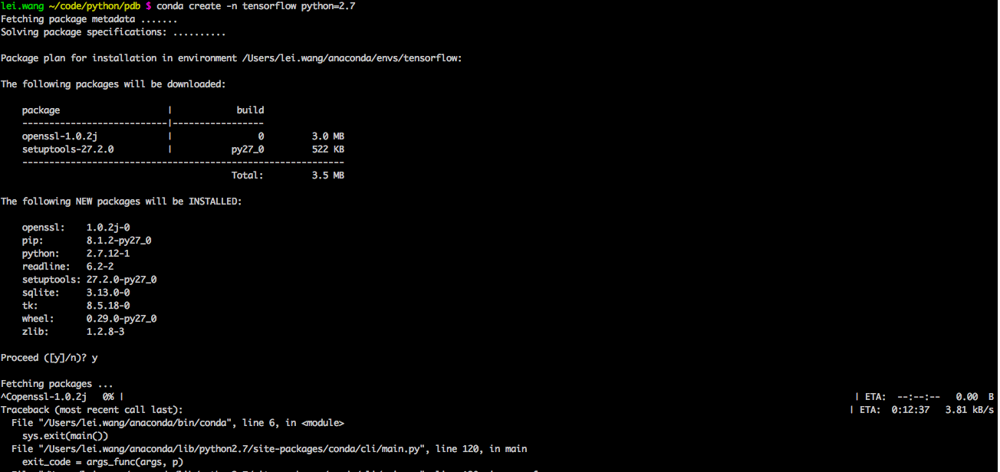
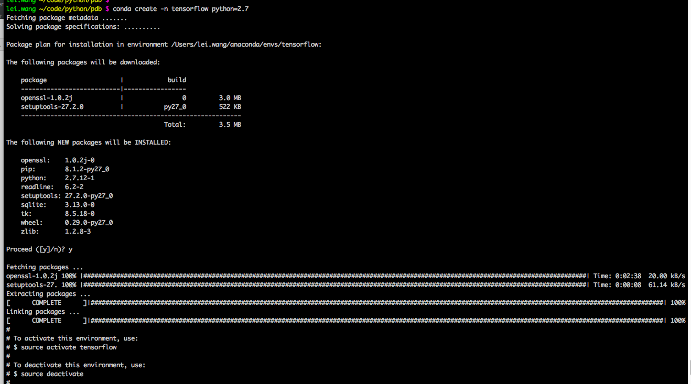
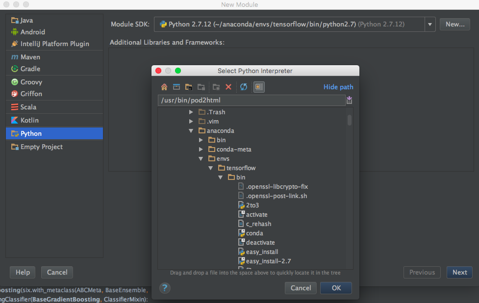

# TensorFlow 安装教程  
### 1. 准备好Anaconda环境

tensorflow是属于很高层的应用。高层应用的一个比较大的麻烦就是需要依赖的底层的东西很多，如果底层依赖没有弄好的话，高层应用是没法玩转的。 
在极客学院有关tensorflow的教程中，提到了这样几种安装方式：Pip, Docker, Virtualenv, Anaconda 或 源码编译的方法安装 TensorFlow。在这里，我强烈推荐大家使用Anaconda的方式安装！因为采用这种方式安装的时候，相当于将所有的底层依赖细节全部已经打包给封装好了！并且，Anaconda还能创建自己的计算环境，相当于将tensorflow的环境与其他环境做了隔离，这样你就可以将tensorflow随便玩，爱怎么玩怎么玩，也不用担心破坏之前的环境！ 
如果是玩数据玩ML的同学，如果你还不知道Anaconda，你就out啦！Anaconda是一个基于Python的科学计算平台，这个平台里包含有python,r,Scala等绝大部分主流的用于科学计算的包。关于Anaconda的安装与介绍，博主之前已经写过一篇博文，请参考http://blog.csdn.net/bitcarmanlee/article/details/51917642一文。

### 2. 建立名叫tensorflow的计算环境

Anaconda的环境准备好了以后，接下来我们建立一个conda的计算环境，给这个环境取名叫tensorflow：  
```
# Python 2.7
$ conda create -n tensorflow python=2.7

# Python 3.4
$ conda create -n tensorflow python=3.4
```
因为我们的版本是2.7，所以执行上面的命令。  
  
坑爹的GFW，麻淡只要是个英文网站就给墙了。心里一边默默问候GFW开发者他们全家，一边无奈地将上述命令重试。终于，重试了n次以后，搞定了  
  

### 3. 激活tensorflow环境，然后用pip安装TensorFlow  
第二步成功以后，先激活tensorflow环境。  
```
source activate tensorflow
```
然后界面华丽丽地就变成了这样：   
  
用户名前有(tensorflow)的标识。我们这样切换，实际上是更换了环境变量里的pip和python。切换到tensorflow的计算环境以后，然后开始用pip安装：  
```
pip install --ignore-installed --upgrade https://storage.googleapis.com/tensorflow/mac/tensorflow-0.8.0rc0-py2-none-any.whl
```

当然上面的命令对应的是python2.7，系统为macos，cpu only。根据tensorflow官方提供的资料，不同的系统与不同的版本命令如下：  

python2.7  
```
# Ubuntu/Linux 64-bit, CPU only, Python 2.7:
(tensorflow)$ pip install --ignore-installed --upgrade https://storage.googleapis.com/tensorflow/linux/cpu/tensorflow-0.8.0rc0-cp27-none-linux_x86_64.whl

# Ubuntu/Linux 64-bit, GPU enabled, Python 2.7. Requires CUDA toolkit 7.5 and CuDNN v4.
# For other versions, see "Install from sources" below.
(tensorflow)$ pip install --ignore-installed --upgrade https://storage.googleapis.com/tensorflow/linux/gpu/tensorflow-0.8.0rc0-cp27-none-linux_x86_64.whl

# Mac OS X, CPU only:
(tensorflow)$ pip install --ignore-installed --upgrade https://storage.googleapis.com/tensorflow/mac/tensorflow-0.8.0rc0-py2-none-any.whl
```

pytho3.x  
```
# Ubuntu/Linux 64-bit, CPU only, Python 3.4:
(tensorflow)$ pip install --ignore-installed --upgrade https://storage.googleapis.com/tensorflow/linux/cpu/tensorflow-0.8.0rc0-cp34-cp34m-linux_x86_64.whl

# Ubuntu/Linux 64-bit, GPU enabled, Python 3.4. Requires CUDA toolkit 7.5 and CuDNN v4.
# For other versions, see "Install from sources" below.
(tensorflow)$ pip install --ignore-installed --upgrade https://storage.googleapis.com/tensorflow/linux/gpu/tensorflow-0.8.0rc0-cp34-cp34m-linux_x86_64.whl

# Mac OS X, CPU only:
(tensorflow)$ pip install --ignore-installed --upgrade https://storage.googleapis.com/tensorflow/mac/tensorflow-0.8.0rc0-py3-none-any.whl
```

命令提交以后，你唯一能做的就是等待了。你唯一能祈祷的，就是这该死的GFW不会坏了你好事。 
还好这次不用重试n次，一次搞定：  
  

至此，tensorflow算是安装OK了！  

### 4. 简单测试是否安装成功：

测试过程很简单，直接上图：  
  

### 5. 集成到IDE里

如果我们要写大家伙，一般会用IDE。将tensorflow集成到IDE里，步骤也很简单。以IntelliJ为例，跟创建普通项目唯一的区别就是，创建普通项目的时候我们的Module SDK选项是系统默认的python解释器。如果我们想要使用tensorflow的相关代码，将Module SDK换为刚刚我们新建的tensorflow计算环境即可！ 
贴个图，大伙就懂了：   
  

### 6. 值得注意的几个小点

1. 强烈推荐使用Anaconda环境安装，真的不是一般的简单方便。 
2. 梯子，还是梯子，不解释。 
3. 激活与退出tensorflow计算环境：  
```
#激活
source activate tensorflow

#退出
source deactivate
```